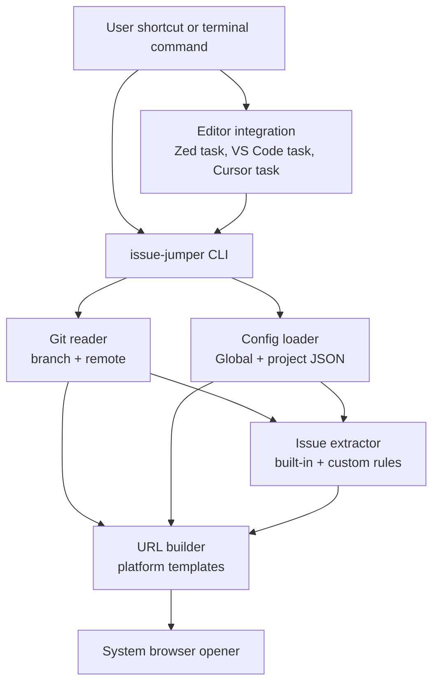
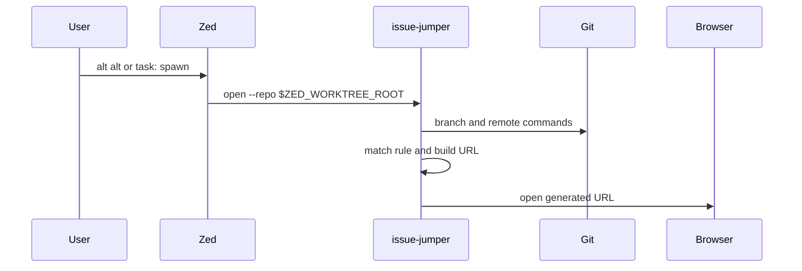

# Architecture

Issue Jumper is a local Rust CLI. Editor integrations are thin adapters that call the same CLI
entry points with the current workspace path.

## Runtime Flow

## Zed Flow

## Module Map

| Module | Path | Responsibility |
| --- | --- | --- |
| `main` | `src/main.rs` | Binary entry point and exit code handling |
| `cli` | `src/cli/` | Command parsing and command-specific output |
| `jump` | `src/jump.rs` | Main orchestration for branch-to-target resolution |
| `git` | `src/git/` | Git command execution and remote URL parsing |
| `issue` | `src/issue/mod.rs` | Built-in and custom branch rule matching |
| `url` | `src/url/mod.rs` | Platform selection and URL construction |
| `config` | `src/config.rs`, `src/config/` | Config loading, merging, and linting |
| `browser` | `src/browser/` | Platform-specific system opener |
| `zed` | `src/zed/` | Zed task/keymap JSON merge and installation |
| `error` | `src/error.rs` | Error taxonomy and exit codes |

## Boundaries

- Core parsing and URL generation live in the shared CLI modules.
- Editor-specific code writes configuration or prints examples only.
- Git hosting APIs are not called; remote URLs and branch names are parsed locally.
- Browser opening is limited to `http://` and `https://` URLs.
- Zed integration uses tasks and keymaps, not Agent slash commands.

## Data Flow

1. Resolve repository path from `--repo` or current working directory.
2. Load global config and the first matching project config.
3. Read current Git branch.
4. Extract an issue ID with custom rules first, then built-in rules.
5. Read `origin` or `upstream` remote when a platform or repository URL needs remote metadata.
6. Resolve platform by command override, rule hint, remote, or fallback config.
7. Build and validate the target URL.
8. Open the URL or print it, depending on the command.

## Repository Fallback

When no issue ID is recognized, GitHub and GitLab remotes can open the repository homepage. This
fallback is disabled when the user explicitly passes `--rule`, because a rule override should fail
clearly instead of opening an unrelated page.

## Install Surface

Homebrew and the shell installer both install the same CLI binary, but they write to different paths.
Zed stores the absolute command path in `tasks.json`, so users should rerun `install-zed --force`
after switching install sources.
